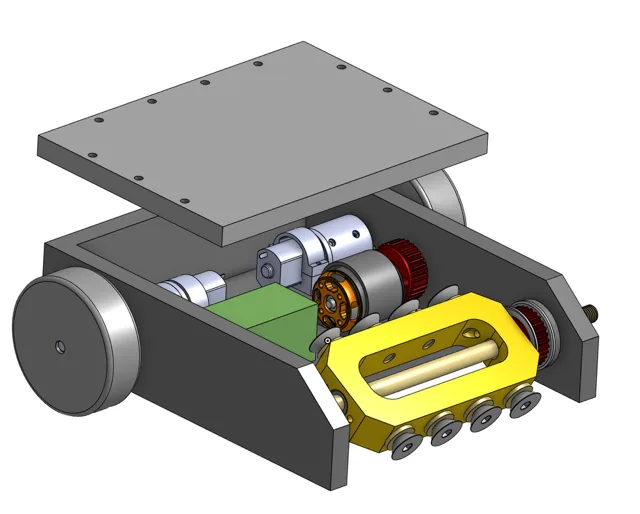
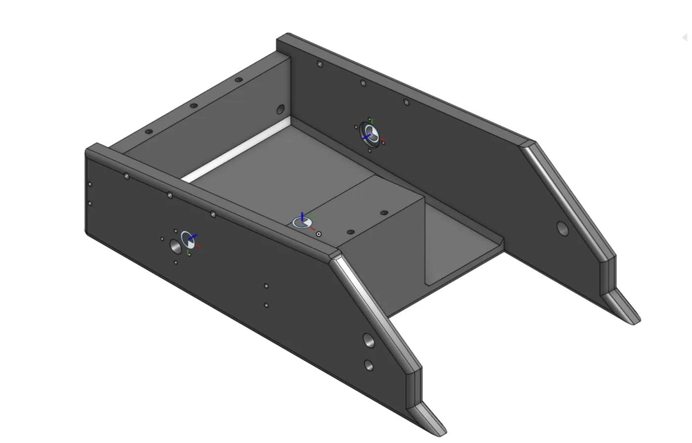
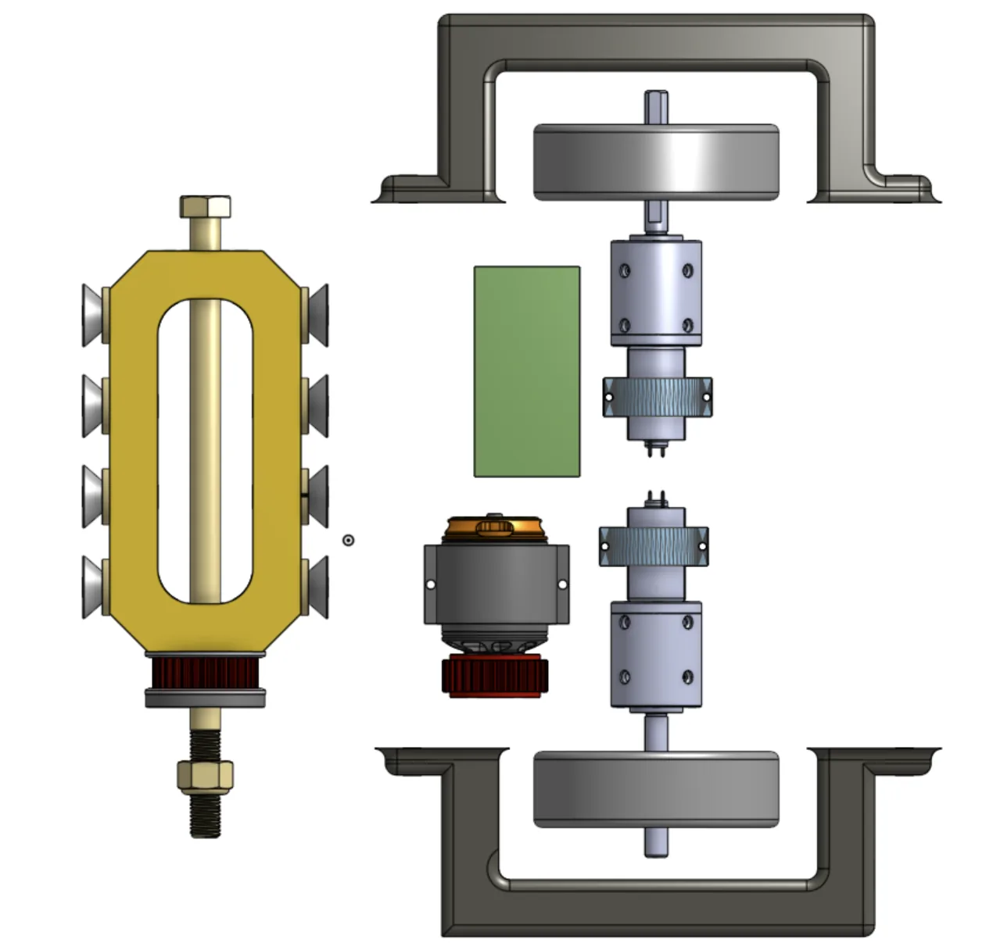

# 3 lb Combat Robot — Drum Weapon

Full-stack mechatronics build for Texas Robo Rumble: CAD architecture, electronics integration, and weapon design. Three chassis iterations to survive a full match; 1–1 record at first event.

**Role:** Mechatronics designer — CAD, electronics, weapon system
**Event:** Texas Robo Rumble
**Stack:** SolidWorks, Onshape, FDM, Repeat Robotics 2836 brushless, 4S LiHV, BLHeli ESCs

## Weapon selection

Chose a drum over three alternatives for a first build with no prior combat data:

- **Flipper** — insufficient force-to-weight margin at 3 lb to reliably invert an opponent
- **Vertical/horizontal spinner** — highest ceiling, but unforgiving bearing/shaft failure modes with zero failure data to design against
- **Wedge** — no offense against a bot that refuses to engage
- **Drum ✓** — sustained contact offense, and the drum mass doubles as forward armor

## Chassis: three prints, one insight

| Build | Config | Failure | Root cause | Fix |
|---|---|---|---|---|
| v1 | Low infill % | Tore at drum mount | Frame flex propagated a tear through layers | Raise infill |
| v2 | High % rectilinear | Shattered on impact; overweight | Dense rectilinear resists steady load but fails brittle under sharp impact | Change *pattern*, not just density |
| v3 ✓ | **20% gyroid** | Held full event | Triaxial lattice distributes impact load in all directions at lower mass | Locked |

**Infill percentage and infill pattern are separate levers** — we'd been treating them as one. Gyroid recovered the weight rectilinear's brittleness cost. Motor/drum mounting holes were also relocated out of the highest-impact zone after testing showed hits could rupture surrounding filament.

## Weapon sizing — first-principles estimate

Sized before ever spinning up: 1800 KV × 15.2 V ≈ 27,400 RPM unloaded → ~17,800 RPM loaded (est. 65%) → **tip speed ≈ 47 m/s (~105 mph)** at 50 mm drum diameter. Estimated from published specs, not tachometer-measured — the point is sizing the weapon against voltage and radius *before* committing to parts.

## Weight budget (est., 1361 g ceiling)

| Subsystem | Mass | % |
|---|---|---|
| Drum + shaft + bearings | ~420 g | 31% |
| Weapon motor (2836) | ~80 g | 6% |
| Drive motors + wheels | ~230 g | 17% |
| Battery (4S LiHV) | ~60 g | 4% |
| ESCs + RX + wiring | ~90 g | 7% |
| Chassis + dividers (gyroid) | ~380 g | 28% |
| Fasteners + margin | ~100 g | 7% |

## ESC fault diagnosis

One ESC dead pre-competition. Isolated it as a manufacturing defect, not a build error: verified input voltage and connector continuity (ruling out our wiring), then swap-tested against a known-good ESC on the same harness — the failure moved with the part. Rebuilt on schedule without re-wiring a harness that was never the problem.

## Match results & next step

Won Match 1 (opponent flipped by their own weapon exchange — no self-righting). Lost Match 2 to the identical failure mode on our side. Not an oversight — a first build had to prioritize a working drum and survivable chassis — but self-righting is the clear next design decision: passive asymmetric shell or active righting arm, funded by the mass the gyroid switch freed up.
